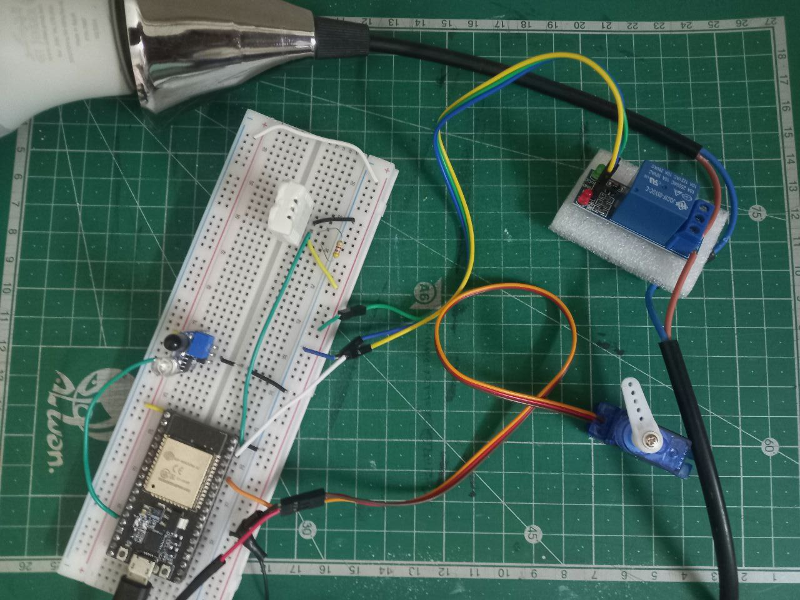

# Voice-Controlled Smart Home Dashboard  

A prototype **smart home system** that combines electronics, web, AI, and cloud services.  
It provides a monitoring dashboard and supports voice-based control, with cloud integration for data transfer and real-time alerts.  

  

---

## Features  

- Monitor indoor climate, presence, lights, and door status  
- Web dashboard for real-time monitoring  
- Voice control using the **Vosk model**  
- Data transfer with **MQTT** via AWS & Mosquitto  
- Real-time alerts using **AWS SNS**  

> **Note on AI Model**  
>  
> To enable the voice control feature, download a Vosk speech recognition model from:  
> 👉 [https://alphacephei.com/vosk/models](https://alphacephei.com/vosk/models)  
>  
> In this project, the following model was used:  
> **`vosk-model-small-en-us-0.15`**  

---

## Tech Stack  

- **Hardware**: ESP32-S, DHT11, IR sensor, Servo motor, Relay, AC bulb  
- **Software**: MicroPython, HTML, CSS, JavaScript  
- **AI**: Vosk (speech recognition)  
- **Cloud**: AWS IoT Core, AWS SNS, Mosquitto MQTT

---

## Dashboard  
 

---
